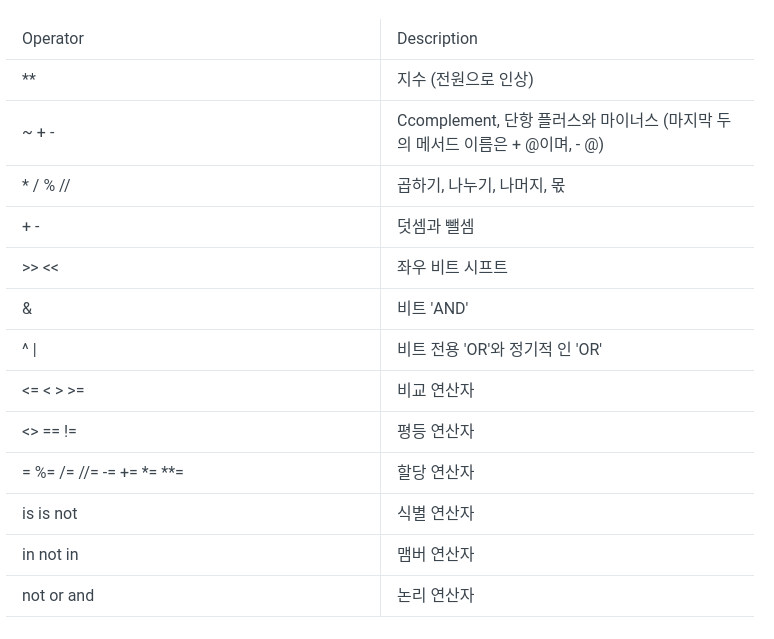

## 연산자의 종류


### 연산의 종류에 따른 분류
* 산술연산자 (+, -, *곱하기, /나누기, //몫, %나머지, **제곱)
* 비교연산자 (==, !=, >=, <=, <,>,<>)
* 할당연산자 (=,+=,-=,*=,/=,%=,**=,//=)
* 논리연산자 (and, or, not)
* Bitwise 연산자 (&,|,^,~,<<,>>)
* 멤버쉽연산자 (in, not in)
* Identity연산자 (is, is not)

### 특이점
* 산술연산자는 우리의 수학적 직관에 일치하는 연산자이다. 
* 비교연산자도 마찬가지. <>는 !=와 비슷하다.
```python
a = 10
a *=2 # a= a*2
print(a) # 20
```
* 할당 연산자가 되게 많이 지원된다. 
* &&, ||, !  대신 영문으로 and 와 or, not을 쓴다.
* in : 좌측 Operand가 우측 컬렉션에 속해 있는지 아닌지를 체크  
```python
a = [1,2,3]
b = 3 in a
print(b) # true
```
* is : 두 객체의 메모리 주소를 비교. 즉, 완전히 똑같고 같은 곳에 저장되어있는 두 객체에 대해서만 `True`를 내밷는다. 
```python
a = "ABC"
b = a
print(a is b)  # True
```

**caution.**
++,--,?: 연산자가 없다. 


### 연산자 간의 우선순위


# 참고문헌
[파이썬 연산자](https://sdc-james.gitbook.io/onebook/3./3.4./1.1.1.)